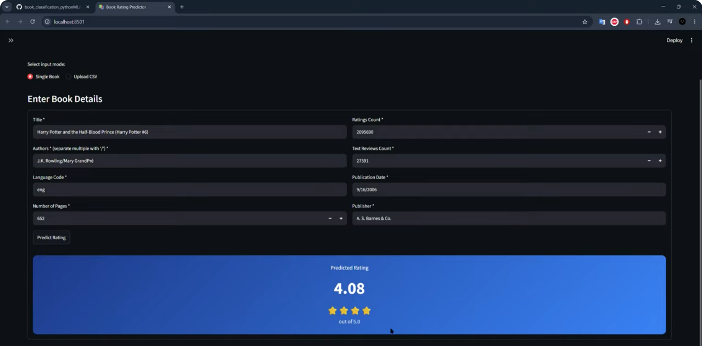

# Book Rating Prediction ML Pipeline (Simplified Branch)

**Predict the average rating of a book (1‑5) using its metadata – all with a single double‑click. No programming knowledge required!**

---

## Quick Start – One‑Click Setup

1. **Clone the project & switch to `simplified` branch using `git checkout simplified`**.
2. **Place the dataset** `books.csv` inside the `data/` folder.  
   *(the dataset has already been provided for simplicity)*
3. Open a terminal in the project folder and execute `./setup_and_run.bat`
4. **Wait** while the script:
   - Installs the correct Python version (if needed)
   - Creates a virtual environment
   - Downloads all required packages
   - Runs the complete machine learning pipeline (data cleaning, feature engineering, model training)
   - Launches the **web application** in your browser

That’s it! You can now use the app to predict ratings for any book.

5. Once you have all the training and necessary files, on next time usage you can simply run the app by executing `.venv\Scripts\activate` then `streamlit run app.py` from the project folder.

---

## If you prefer a step‑by‑step Jupyter Notebook

Instead of the automatic script, you can explore every detail of the pipeline inside an interactive notebook:

1. Open a terminal in the project folder and execute `./setup_and_run.bat`
2. Using the same terminal or open another one at the project directory ( if needed ) and run:

   ```
   .venv\Scripts\python.exe generate_notebook.py
   ```

   ```
   .venv\Scripts\python.exe -m jupyter notebook notebooks/complete_pipeline.ipynb
   ```

4. The notebook will open in your browser. Run each cell one by one to see the data cleaning, feature engineering, model training, and evaluation in detail. Every step is explained with **what** and **why**.

---

## What’s inside this project?

| File / Folder | What it does |
|---------------|---------------|
| `setup_and_run.bat` | One‑click script that does **everything**: installs Python, sets up the environment, trains the model, and launches the app. |
| `run_training.py` | The full machine learning pipeline in a single file. It cleans the data, engineers features, trains and compares models, and saves the final model. |
| `app.py` | The Streamlit web application that uses the trained model to make predictions. |
| `notebooks/complete_pipeline.ipynb` | A Jupyter notebook that walks you through every step of the pipeline interactively. Perfect for learning and assignments. |
| `requirements.txt` | List of Python packages needed. They are installed automatically by the setup script. |
| `data/books.csv` | **You must place the raw dataset here.** For simplicity, it has been included in the repository. |
| `data/test_batch.csv` | An example csv containing books not used for training. It can be used to test the webapp in csv mode. |
| `models/` | After training, this folder will contain the serialised model (`best_pipeline.joblib`) and feature names. |
| `reports/` | After training, this folder will contain all evaluation reports (CSV and TXT) and plots (PNG). main.tex uses them at the time of pdf report generation (done with prism). |

---

## Understanding the generated reports

After running `run_training.py` (or the notebook), you’ll find these files in the `reports/` folder:

| File | What it tells you |
|------|-------------------|
| `data_quality_summary.txt` | How many rows were in the raw data, how many were kept after cleaning, and what outlier capping was applied. |
| `feature_engineering_summary.txt` | List of all features created and the 8 selected for the final model. |
| `baseline_model_comparison.csv` / `baseline_summary.txt` | Performance of simple models (Dummy, Linear Regression, Ridge, Lasso). |
| `advanced_model_comparison.csv` / `advanced_summary.txt` | Performance of the tuned advanced models (Random Forest, XGBoost, LightGBM, CatBoost) with their best hyperparameters. |
| `final_evaluation_summary.txt` | Which model was chosen as the best, and a full comparison of all models. |
| `report_latex/figures/` | Many PNG images showing residual plots, feature importance, SHAP explanations, and error analysis for each model. |

---

## Using the Web Application

Once the app is running (usually at http://localhost:8501), you have two choices:

- **Single Book** – Fill in the title, authors, page count, ratings count, etc., and click **Predict Rating**. You’ll see a styled card with the predicted rating (e.g., 4.05 / 5).
- **Upload CSV** – Upload a CSV file with the same columns as the original dataset (you can use the included `data/test_batch.csv` as a template). The app will predict ratings for all rows and let you download the results.



---

## Model Performance (summary)

The pipeline automatically picks the best model. Here are the final numbers (from the generated reports):

| Model               | CV RMSE | Test RMSE | Test R² |
|---------------------|---------|-----------|---------|
| Dummy Regressor     | 0.2920  | 0.2974    | 0.0000  |
| Linear Regression   | 0.3220  | 0.2481    | 0.3040  |
| Ridge               | 0.3232  | 0.2481    | 0.3039  |
| Random Forest       | 0.2412  | 0.2461    | 0.3152  |
| LightGBM            | 0.2409  | 0.2446    | 0.3236  |
| CatBoost            | 0.2400  | 0.2450    | 0.3210  |
| XGBoost             | 0.2411  | 0.2436    | 0.3292  |
| **Final Model (XGBoost)** | 0.2411  | **0.2436** | **0.3292** |

---

## Documentation

- [Final Report (PDF)](reports/final_report.pdf) – full academic report with methodology, results, and conclusions.

---

## Demo Video

Watch a short demonstration of the web app:  
https://youtu.be/9ORi7gDnzN8

---

## License

This project is for academic purposes. Developed by Nahasat Nibir, Jett Guitteau, Sébastien Martel, & Sunny Mondal.
